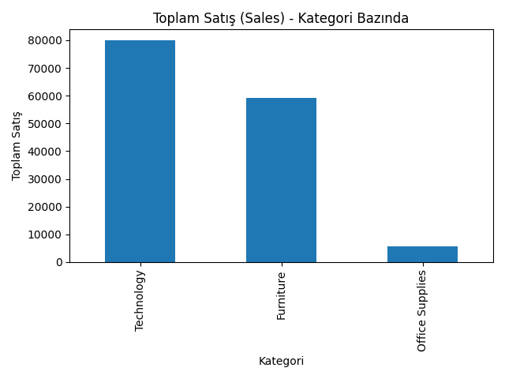
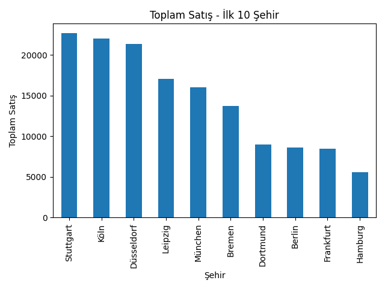
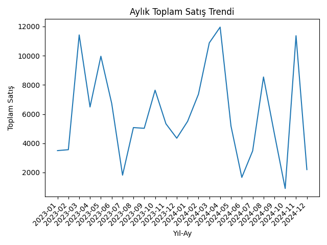
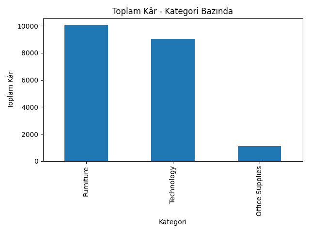

# Sales Data Analysis (Sample Project)

This repository contains a beginner-friendly, step-by-step Exploratory Data Analysis (EDA) on a synthetic "superstore-like" sales dataset.

## Goals
- Load and inspect a tabular dataset
- Clean and prepare data (dates, missing values, duplicates)
- Answer business questions using groupby/aggregations
- Visualize results with matplotlib
- Save insights and charts to the `results/` folder

## Dataset
- File: `data/sales_sample.csv`
- Rows: 250 (Germany-only cities, 2023-2024)
- Columns: `OrderID, OrderDate, Country, City, Segment, Category, SubCategory, ProductName, Quantity, Discount, Sales, Profit`

## How to run (Windows/macOS/Linux)
1. Install Python 3.11+ from https://www.python.org/downloads/
2. Open a terminal (Command Prompt or PowerShell on Windows)
3. Create and activate a virtual environment (recommended):
   ```bash
   python -m venv .venv
   # Windows:
   .venv\Scripts\activate
   # macOS/Linux:
   source .venv/bin/activate
   ```
4. Install dependencies:
   ```bash
   pip install -r requirements.txt
   ```
5. Launch Jupyter Lab:
   ```bash
   jupyter lab
   ```
6. Open `notebooks/sales_analysis.ipynb` and run cells in order.

## Results
- Generated charts and summary files will be saved to `results/`.

## File Structure
```
sales-analysis/
├─ data/
│  └─ sales_sample.csv
├─ notebooks/
│  └─ sales_analysis.ipynb
├─ results/
│  ├─ charts/ (created at runtime)
│  └─ insights.md (at runtime)
├─ README.md
└─ requirements.txt
```"# sales-analysis" 
"# sales-analysis" 
---
Author: Feyza
## Charts





